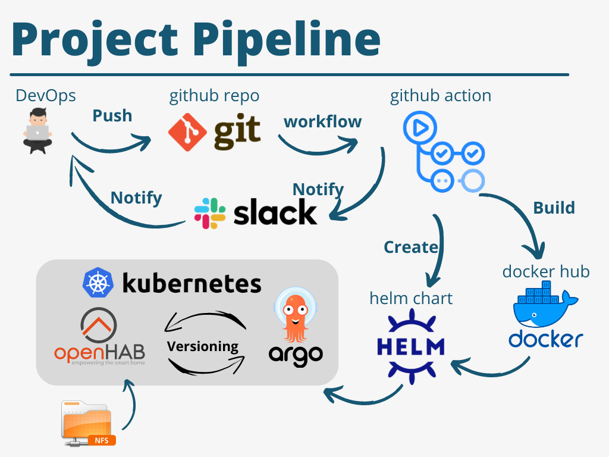

# Project report
---
# Project's reporter: Aleksei Dubailo
- Group number: md-sa2-21-22
- LinkedIn profile: https://www.linkedin.com/in/alexey-dubailo/

## Description of application for deployment:

- Name of application: Openhab
- Programming language: Java
- App use NFS share to storage userdata files.

---

---
## Technologies which were used in project

- Orchestration: Kubernates
- Automation tools: ArgoCD, Github action
- SCM: Github
- Notification: Slack
- Other tools: Docker, Helm, NFS

**CI/CD description:**  After pushing to the main branch, Git Action bump tag version, builds image and push to Docker HUB.
After that, it check template manifests and creates a HELM chart package in ./reseases folder.
ArgoCD connected to helm repo, sync with it.

**Rollback flow description and implementation:**
With the help of ArgoCD, you can study the transition to different versions of application.

## Links

[Project on github](https://github.com/AlexeyAsgard/project)
[Docker HUB repo](https://hub.docker.com/repository/docker/alexeyby/openhab/general)
[Openhab git repo](https://github.com/openhab/openhab-docker)
